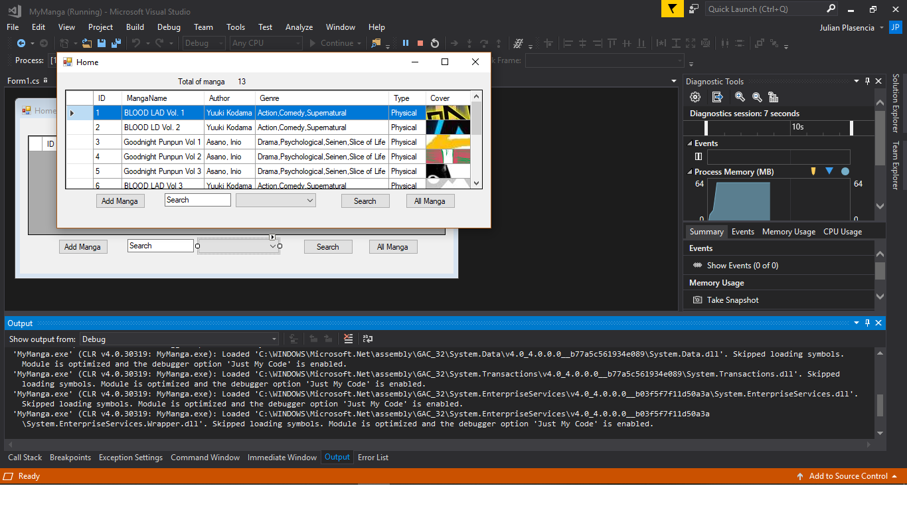
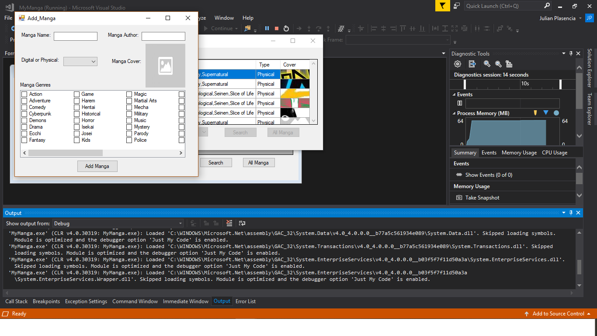
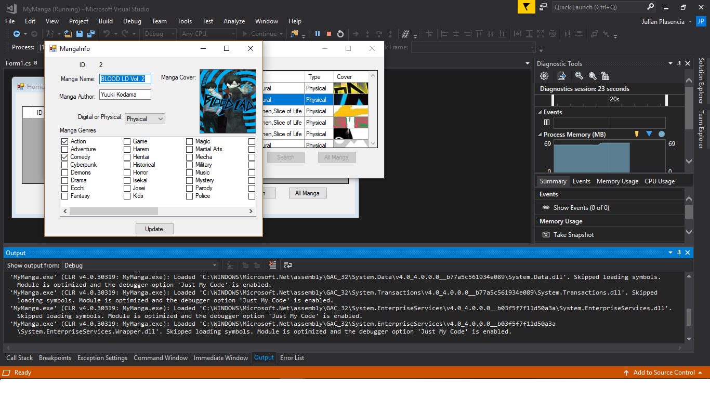
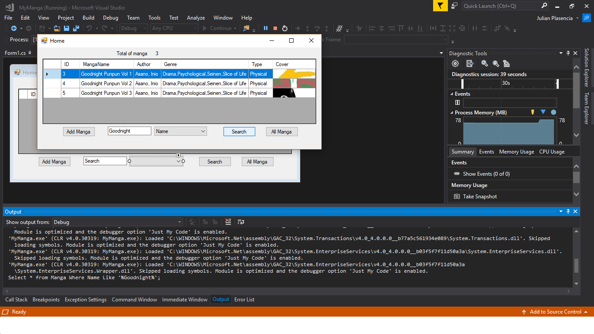

# Book-Organizer
A small book organizer project made from C# and .NET using Microsoft visual studio.   
Originally used for my manga collection, Its displays all the books in a Microsoft Access database. You can add to the database and update data by double clicking a row. You are also able to search there the database threw the search feature.   
Somethings I have left to do/ would like to do. 
* prevent duplicating
* Code condensing
* Make some variables global
* GUI editing

# Screenshots
___
Home 
 
Add 
 
Update 
 
Search 

